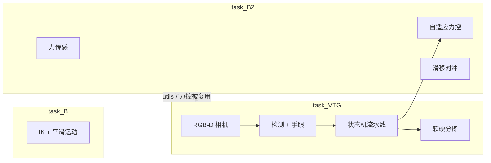

# my-reBot-DevArm

基于 [PyBullet](https://pybullet.org/) 的 [reBot-DevArm](https://github.com/Seeed-Projects/reBot-DevArm) 六轴机械臂仿真工程：点到点运动（任务 B）→ 自适应力控抓取（任务 B2）→ 视触融合分拣（任务 VTG / v2.0）。

**仓库**：[https://github.com/XIAOHU7771/my-reBot-DevArm](https://github.com/XIAOHU7771/my-reBot-DevArm)

[](https://www.python.org/)
[]()
[](https://github.com/XIAOHU7771/my-reBot-DevArm/releases)

---

## 一、项目概览

| 模块 | 目录 | 能力 |
|------|------|------|
| **任务 B** | `task_B/` | 加载 URDF；输入 TCP `(x,y,z)`；IK + 关节插值平滑到达 |
| **任务 B2** | `task_B2/` | 虚拟力传感；铁块/海绵自适应力控；抬升后滑移对冲 |
| **任务 VTG** | `task_VTG/` | 顶视 RGB-D 定位 → 调用 B2 力控 → 软/硬分区放置；（进阶）下探重跟踪 |

**依赖关系**：VTG **不重写**力控 PID，通过 `task_VTG/grasp/adaptive_bridge.py` 调用 `task_B2/2.adaptive_force_control_grasp.py`。

**夹爪约定**：URDF 左右行程不一致（左约 0–0.05 m，右约 0–0.0715 m）。工程统一采用**指心对称开合**（`keep_center`），避免单指先触、左右正压力失衡。



---

## 二、仓库结构

```text
my-reBot-DevArm/
├── task_B/                         # 任务 B：点到点运动
│   ├── find_ee.py                  # 查询关节 / 末端 Link 索引
│   └── rebot_sim.py                # 输入 (x,y,z) → IK → 平滑运动
│
├── task_B2/                        # 任务 B2：力觉能力库 + 演示脚本
│   ├── 1.Force_Sensor_Simulation.py
│   ├── 2.adaptive_force_control_grasp.py
│   ├── 3.slip_compensation_test.py
│   └── utils/
│       ├── robot.py                # 加载含夹爪 URDF
│       ├── gripper.py              # 指心对称开合 + 力读数
│       ├── ik.py                   # TCP 逆解与精调
│       └── scene.py
│
├── task_VTG/                       # 任务 VTG：视触融合（Vision-Tactile Grasping）
│   ├── config.py                   # 放置区、颜色映射、随机范围
│   ├── pipeline.py                 # 状态机编排
│   ├── vision/                     # 相机 / 检测 / 手眼 / 标注
│   ├── grasp/adaptive_bridge.py    # 薄封装调用 B2 力控
│   ├── motion/                     # 预抓取、回位、重跟踪接近
│   ├── sort/place_zones.py         # soft→A / hard→B
│   ├── tracking/retrack.py         # 下探位置级重跟踪
│   ├── scripts/                    # 可执行入口（见第五节）
│   └── debug_images/               # 顶视 RGB / 标注图产出
│
├── urdf/
│   ├── reBot-DevArm_fixend_description/   # 任务 B：固定末端
│   └── 00-arm-rs_asm-v3/                   # 任务 B2 / VTG：平行夹爪
│
├── force_data/                     # 运行后力控 CSV / 曲线（仓库根或 task_B2 下）
├── requirements.txt
└── README.md
```

---

## 三、环境配置

| 项目 | 要求 |
|------|------|
| Python | ≥ 3.10 |
| OS | Windows / Linux / macOS |
| 依赖 | `numpy`、`matplotlib`、`pybullet`（见 `requirements.txt`） |

```bash
git clone https://github.com/XIAOHU7771/my-reBot-DevArm.git
cd my-reBot-DevArm

python -m venv .venv
# Windows:  .\.venv\Scripts\Activate.ps1
# Linux/macOS:  source .venv/bin/activate

pip install -r requirements.txt
```

> Windows 安装 PyBullet 若失败：安装 [Microsoft C++ Build Tools](https://visualstudio.microsoft.com/visual-cpp-build-tools/)（勾选「使用 C++ 的桌面开发」）后重试。

**所有命令默认在仓库根目录执行**（VTG 脚本依赖根目录下的 `task_B2` / `urdf` 路径）。

---

## 四、功能说明

### 4.1 任务 B — 运动仿真（`task_B/`）

- 加载固定末端 URDF，PyBullet IK 求解关节角  
- 终端输入目标 TCP，关节空间插值平滑运动  
- `find_ee.py` 核对末端 Link 索引（常见为 6）

### 4.2 任务 B2 — 力控抓取（`task_B2/`）

1. **虚拟力传感**（`1.Force_Sensor_Simulation.py`）  
   `getContactPoints` 正压力 + 关节力传感器，导出 CSV / 曲线  

2. **自适应力控**（`2.adaptive_force_control_grasp.py`）  
   同场景铁块（硬/重）+ 海绵（软/轻）  
   接触 → 探刚度 → 选 `F_safe` → PID 恒力 → 抬升验证  
   `--force-control` / `--no-force-control` 开闭对照  

3. **滑移对冲**（`3.slip_compensation_test.py`）  
   抬升后向下外力扰动；开启对冲则自动加紧，关闭易掉落  

### 4.3 任务 VTG — 视触融合（`task_VTG/`）

| 环节 | 实现 |
|------|------|
| 视觉 | Eye-to-Hand 顶视 RGB-D；HSV 红/黄检测；相机系 → 基座系 |
| 运动 | IK 预抓取 → 下探对齐 |
| 力觉 | bridge 调用 B2 自适应力控（硬大力 / 软小力） |
| 分拣 | 黄/软 → `ZONE_A`；红/硬 → `ZONE_B` |
| 进阶 | 下探中物体被平移 → `[RETRACK]` 更新目标再抓 |

```text
DETECT → SELECT → APPROACH → FORCE_GRASP → LIFT → TRANSPORT → PLACE → RETREAT → …
```

---

## 五、运行说明

### 5.1 任务 B

```bash
python task_B/find_ee.py
python task_B/rebot_sim.py
# 示例目标：0.15, 0.0, 0.15
```

推荐工作空间：`x ∈ [0.05, 0.25]`，`y ∈ [-0.15, 0.15]`，`z ∈ [0.05, 0.25]`。

### 5.2 任务 B2

```bash
cd task_B2

python 1.Force_Sensor_Simulation.py
python 2.adaptive_force_control_grasp.py --force-control
python 2.adaptive_force_control_grasp.py --no-force-control --only sponge
python 3.slip_compensation_test.py --compensate
python 3.slip_compensation_test.py --no-compensate

# 无 GUI 烟测可加 --direct
```

产出：`force_data/` 下 CSV 与力控曲线图。

### 5.3 任务 VTG（主 Demo）

| 目的 | 命令 |
|------|------|
| **GUI 全自动分拣（录屏 / 画面二）** | `python task_VTG/scripts/run_pipeline_m4.py --seed 7 --annotate` |
| 无窗口烟测 | `python task_VTG/scripts/run_pipeline_m4.py --direct --no-force-log --seed 7 --annotate` |
| **顶视标注图（画面一）** | `python task_VTG/scripts/annotate_frame.py --seed 7` |
| 固定坐标通管道（不依赖视觉） | `python task_VTG/scripts/run_pipeline_m3.py --direct --no-force-log` |
| 相机存图 | `python task_VTG/scripts/save_camera_frame.py --direct` |
| 检测 + 手眼误差 | `python task_VTG/scripts/test_detect_localize.py --direct` |
| 下探重跟踪 | `python task_VTG/scripts/run_retrack_demo.py --direct --retrack --nudge --no-force-log` |

常用参数：

- **去掉 `--direct`** → 弹出 PyBullet 3D 窗口（可视化）  
- `--annotate` → 保存顶视检测标注到 `task_VTG/debug_images/`  
- `--no-force-log` → 不写力控曲线（更快）  
- `--seed N` → 随机摆放可复现  

（模块细节见仓库内 `task_VTG/` 源码与脚本注释；本地可另备运行说明文档。）

---

## 六、核心算法简述

### 6.1 逆运动学（B / B2 / VTG 共用思路）

目标 TCP + 当前关节角 → `calculateInverseKinematics` → 关节空间平滑插值 → 位置控制驱动。

### 6.2 指心对称开合（B2）

左右行程不同时保持 `q_right - q_left` 恒定，指心不漂，双侧接触更均匀。

### 6.3 自适应力控 + 滑移对冲（B2）

```text
闭合接触 → 微探 k≈ΔF/Δw → 选 F_safe(硬高/软低)
         → PID 恒力 → 抬升验证
抬升后外力 ↓ → 滑移/摩擦异常 → 对称加紧（对冲开启时）
```

### 6.4 视触融合（VTG）

```text
RGB-D → 颜色质心 + 深度中位数 → (X,Y,Z)_cam
      → T_base_cam → (x,y)_base（抓取高度用桌面半高）
      → IK 预抓取 → B2 力控 → 分区放置
```

---

## 七、交付对照

| 产出 | 状态 |
|------|------|
| 任务 B：IK 点位运动 Demo | ✅ [v1.0 Demo](https://github.com/XIAOHU7771/my-reBot-DevArm/releases/tag/v1.0) |
| 任务 B2：力控开/关对比 Demo | ✅ [v2.0 力控演示](https://github.com/XIAOHU7771/my-reBot-DevArm/releases/tag/v2.0) |
| 任务 VTG：工程目录 + 架构/README | ✅ `task_VTG/`（Vision-Tactile-Grasping） |
| Video Demo 3.0 画面一（标注坐标） | ✅ `annotate_frame.py` / `--annotate` → `debug_images/` |
| Video Demo 3.0 画面二（自动分拣） | ✅ GUI：`run_pipeline_m4.py --seed 7 --annotate` |

---

## 八、故障排查

| 问题 | 处理 |
|------|------|
| PyBullet 安装失败 | 安装 C++ Build Tools 后重装 |
| IK 失败 / 臂不动 | `python task_B/find_ee.py` 核对末端；目标改到推荐工作空间 |
| 插值过快 / 像瞬移 | `task_B/rebot_sim.py` 增大 `steps` 或略增 `time.sleep` |
| 夹爪左右力差过大 | 确认指心对称开合（`keep_center=True`） |
| 找不到 URDF | 从**仓库根目录**运行；确认 `urdf/` 存在 |
| VTG `import utils` 失败 | 不要在 `task_VTG/` 内乱改 cwd；按第五节从仓库根执行 |
| 力控曲线中文变方框 | 已在 B2 `GraspRecorder.save()` 内配置中文字体；重新跑一遍生成新图 |
| VTG 检测不到物体 | 先回 HOME 再拍；确认红/黄外观；用 `test_detect_localize.py` 看 overlay |
| 无 3D 窗口 | 去掉命令中的 `--direct` |

---

## 九、许可证与致谢

本项目基于 reBot-DevArm 开源机械臂，遵循 **CERN-OHL-W-2.0**。

- [reBot-DevArm](https://github.com/Seeed-Projects/reBot-DevArm) — 开源六轴机械臂硬件  
- [PyBullet](https://pybullet.org/) — 多刚体物理仿真  
- [reBotArm_control_py](https://github.com/vectorBH6/reBotArm_control_py) — 运动学与实机控制参考  
