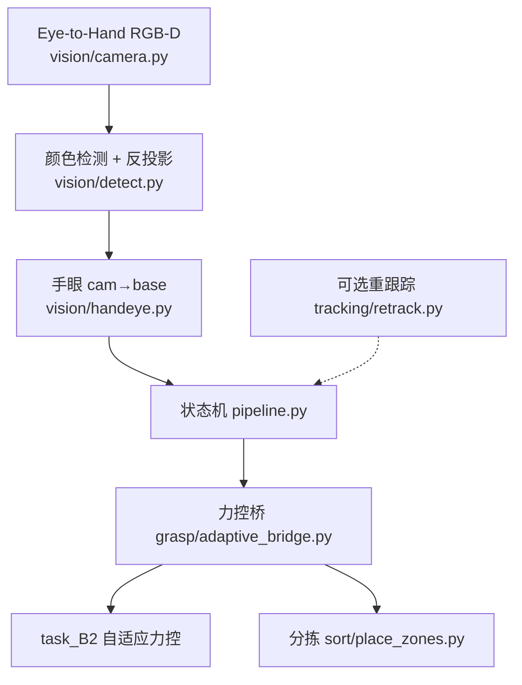

# task_VTG — 视触融合抓取（Vision-Tactile Grasping）

用顶视 RGB-D **看见**物体，用 `task_B2` 自适应力控 **抓紧**，再按软/硬 **分拣放置**。力控不重写，经薄封装调用 B2。

**怎么跑（工作流 / 调用链 / 脚本入口）→ [运行说明.md](运行说明.md)**

设计依据：[视触融合任务说明.md](../视触融合任务说明.md) · 开发方式：[本工程如何用AI开发（提示词说明）.md](../本工程如何用AI开发（提示词说明）.md)

---

## 1. 依赖与前提

- 在**仓库根目录**运行下列命令  
- Python ≥ 3.10，依赖见根目录 `requirements.txt`：`numpy` / `matplotlib` / `pybullet`  
- 复用 `task_B2/utils` 与 `2.adaptive_force_control_grasp.py`（勿删 B2）  
- 推荐先烟测：所有脚本加 `--direct`（无 GUI）

```bash
pip install -r requirements.txt
```

---

## 2. 系统架构



**状态机（简）**：`DETECT/LOAD → SELECT → APPROACH → FORCE_GRASP → LIFT → TRANSPORT → PLACE → RETREAT → …`

---

## 3. 目录（与实现一致）

```text
task_VTG/
├── config.py                 # 放置区、随机范围、颜色映射、RETRACK_*
├── pipeline.py               # 流水线状态机
├── vision/
│   ├── camera.py             # 顶视 RGB-D
│   ├── detect.py             # HSV 红/黄 → 相机系 3D
│   ├── handeye.py            # T_base_cam
│   ├── targets.py            # 检测 → 待抓列表
│   └── annotate.py           # Demo 画面标注
├── grasp/adaptive_bridge.py  # 调用 B2，不重写 PID
├── motion/                   # 预热 / 分段接近 / 回位
├── sort/place_zones.py       # soft→A / hard→B
├── tracking/retrack.py       # M6 位置级重跟踪
├── scripts/                  # 各里程碑入口
└── debug_images/             # 存图（git 忽略 PNG）
```

---

## 4. 里程碑命令（均在仓库根目录）

| 里程碑 | 做什么 | 命令 |
|--------|--------|------|
| **M1** | 顶视存 RGB + Depth | `python task_VTG/scripts/save_camera_frame.py --direct` |
| **M2** | 红黄检测 → base，对比 GT | `python task_VTG/scripts/test_detect_localize.py --direct` |
| **M3** | 固定坐标：力控抓取 + 分拣 | `python task_VTG/scripts/run_pipeline_m3.py --direct --no-force-log` |
| **M4** | 随机摆放 + 视觉坐标接入 | `python task_VTG/scripts/run_pipeline_m4.py --direct --no-force-log --seed 7` |
| **M5** | 标注图（画面一） | `python task_VTG/scripts/annotate_frame.py --direct --seed 7` |
| **M5+** | 流水线 DETECT 后存标注 | 在 M4 命令后加 `--annotate` |
| **M6** | 下探中 nudge + 重跟踪 | `python task_VTG/scripts/run_retrack_demo.py --direct --retrack --nudge --no-force-log` |

去掉 `--direct` 可开 PyBullet GUI（更慢，便于录屏）。

---

## 5. 推荐 Demo 路径（最短可复现）

1. **M3** 确认力控+分拣通：`run_pipeline_m3.py --direct --no-force-log` → 汇总 `PASS (2/2)`  
2. **M4** 确认视觉闭环：`run_pipeline_m4.py --direct --no-force-log --seed 7`  
3. **M5** 出标注图：`annotate_frame.py --direct --seed 7` → 打开 `task_VTG/debug_images/m5_annotate_seed7.png`  
4. （加分）**M6**：`run_retrack_demo.py --direct --retrack --nudge --no-force-log` → 日志含 `[RETRACK]`

---

## 6. 坐标系与类别约定

| 约定 | 说明 |
|------|------|
| 世界系 ≈ 基座系 | 臂固定在原点 |
| 相机系 | OpenGL：看向 −Z；与 PyBullet `viewMatrix` 一致 |
| 抓取高度 Z | 固定 `CUBE_HALF=0.025`（不用顶面深度当地板高） |
| 红 → hard / 铁块 | 进 `ZONE_B_HARD` |
| 黄 → soft / 海绵 | 进 `ZONE_A_SOFT` |

放置区中心见 `config.py` 中 `ZONE_A_SOFT` / `ZONE_B_HARD`。

---

## 7. 失败日志含义

| 标记 | 含义 |
|------|------|
| `reason=detect_miss` | 未检出目标 |
| `reason=grasp_fail` | 接近/力控/抬升失败 |
| `reason=place_miss` | 放下了但未进区 |
| `[RETRACK] moved` | 目标 XY 超阈值，已更新 |
| `[RETRACK] detect_miss` | 重跟踪时丢检，暂保留旧目标 |
| `[NUDGE]` | Demo 强制平移物体（M6） |

---

## 8. 版本建议

实现对应里程碑 M1–M7。若打 git tag，建议名：`vtg-m7`（需维护者本地执行，本 README 不自动打 tag）。

---

## 9. 相关文档

- [视触融合任务说明.md](../视触融合任务说明.md) — 目标、知识点、里程碑定义  
- [新手入门讲解.md](../新手入门讲解.md) — 仿真 / IK / 夹爪基础  
- [task_B2](../task_B2/) — 力控能力库（被 bridge import）
